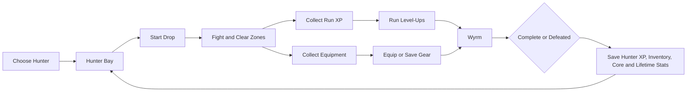

# Progression

**Last Updated:** 2026-08-03  
**Status:** Persistent profiles and early progression implemented

## Progression Flow

## In-Run State

The run tracks health, run XP/level and upgrades, kills, timer, active enemies/projectiles/pickups, combo state, Wastes zones/gates, boss state, messages, and recent finds. New drops rebuild The Wastes and reset those transient systems.

## Hunter XP and Levels

Hunter XP is persistent and awarded through the run/results flow. The next-level requirement begins at 10 and multiplies by 1.4 after each level. Central rewards through level 10 provide small Max Health, Base Attack, or Base Defense gains; Level 8 unlocks Drop Tier 2. Rewards are derived from level so reloads do not stack them.

## Drop Tiers and Scaling

Tier 1 is available from level 1. Tier 2 unlocks at level 8 and is optional: +15% regular enemy health, +10% damage, +20% Wyrm health, +10% Wyrm damage, and a 1.05 rare-drop chance multiplier. Existing progression scaling also considers Core level, equipped-weapon rarity/attack, and defeated Wyrms. Movement speed and spawn density are not the primary scaling levers.

## Equipment Progression

Weapons and armor are profile-owned inventory items. Weapon rolls, rarity, and affixes drive combat identity. One weapon and one suit are equipped; new Hunters and migrated armor-less profiles receive a Worn Hunter Suit (Defense 5). Armor world drops are **planned**.

## Core Progression

Feeding equipment grants Core progress and stats. Level requirements start at 100 and add 25 per Core level. Dormant evolves to Awakened at level 10. See [`MAG.md`](MAG.md).

## Boss and Completion Rewards

Defeating the Wyrm completes a drop, records a boss defeat, and guarantees the boss rare-equipment reward path. Death still preserves equipment already acquired and other persistent progress before returning to the Hunter Bay.

## Persistent Per-Hunter Data

- Full inventory and equipped weapon/armor.
- Core level, experience, stats, and stage.
- Hunter level/XP and base progression values.
- Selected drop tier, hunter name, currency placeholder, lifetime runs/kills/bosses.
- Tutorial completion/skip/current step.

These live in independent localStorage profile records with a lightweight profile index and active-profile ID. Legacy single-save and `mag` data migrate at the persistence boundary.

## Reset Boundaries

Starting another drop never resets profile progression. **Reset Hunter** restores fresh inventory, starter armor, null weapon, Core, Hunter level/XP, tutorial, tiers, and lifetime progression while preserving profile identity/name. **Delete Profile** removes only the selected Hunter.

## Planned Expansion

Armor drops, more content milestones, and carefully expanded long-term progression are planned. Skill trees, classes, account-wide rewards, prestige, online saves, and crafting are not implemented.

